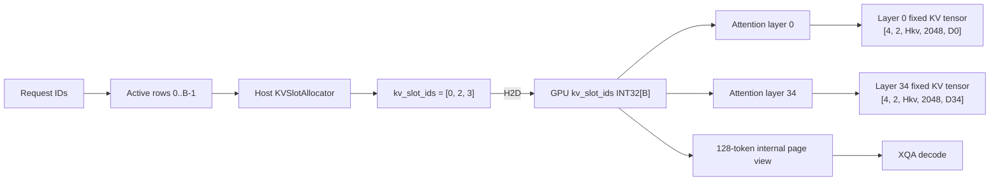
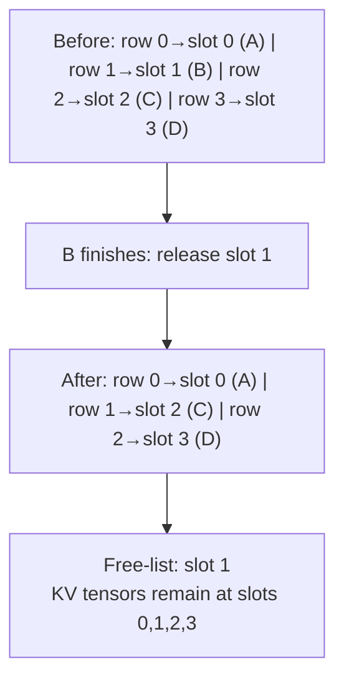

# Gemma 4 E2B INT4 / indexed-linear 실행 노트

## 고정 조건

- `google/gemma-4-E2B-it`, RTX 3080 10GB (SM86)
- backbone INT4-AWQ; embedding, PLE, LM head, KV cache FP16
- batch 4, input 1024, KV capacity 2048, vanilla text-only
- WikiText 128 calibration samples, seed 0

## 실행 순서

1. `nvcr.io/nvidia/pytorch:25.12-py3`에서
   `scripts/gemma4_e2b_indexed/run_quant_export.sh`를 `MODE=legacy`와
   `MODE=indexed`로 실행한다.
2. CPU ModelOpt가 미지원이거나 메모리/연산 오류가 나면 중단한다.
   이 단계에서는 quantizer offload를 추가하지 않는다.
3. `nvcr.io/nvidia/tensorrt:26.06-py3`에서 `run_build_runtime.sh`를
   두 모드에 실행한다.
4. `collect_manifest.sh`로 image digest, commit, driver/toolchain과 모델
   파일 SHA256을 보존한다.

## ownership 계약

- `kv_slot_ids[B]`는 active row가 소유한 physical slot을 가리킨다.
- eviction은 KV 본체를 이동하지 않고 active length와 slot ID만 compact한다.
- decode XQA는 capacity를 128-token page로 보는 내부 page table을 사용한다.
- 실제 allocation은 `[maxSlots, 2, Hkv, capacity, D]` 그대로다.
- legacy export에는 slot 입력이나 indexed plugin attribute가 없다.

## phase 분리 gate

- greedy token 동일성
- indexed XQA 대 contiguous reference `atol=1e-2`, `rtol=1e-2`
- 모든 prefill/decode scenario에서 median과 p95 회귀 각각 3% 이하
- indexed eviction 구간 KV D2D copy 0 byte
- 최소 512 MiB VRAM headroom

이 gate가 통과하기 전에는 stream/context/SM-mask scheduler를 구현하지 않는다.

## SM86 빌드 조건

Gemma 4의 full-attention layer는 head dimension 512이므로 SM86 기본 FMHA가 처리하지 못한다. RTX 3080 빌드에는 CuTe DSL FFPA artifact가 필요하며 `run_build_runtime.sh`는 CUDA 13.3, `CMAKE_CUDA_ARCHITECTURES=86`, `AARCH64_BUILD=OFF`, `ENABLE_CUTE_DSL=ffpa`, `CUTE_DSL_ARTIFACT_TAG=sm_86`을 기본으로 사용한다.

## 구현 흐름

1. export의 `--indexed-kv-cache`가 config의 `indexed_kv_cache=true`를 만들고 ONNX에 `kv_slot_ids: INT32[B]` 입력을 추가한다. 기본값은 false이므로 legacy ABI는 바뀌지 않는다.
2. builder는 indexed config에서만 `kv_slot_ids` profile을 만들고 attention plugin은 `enable_indexed_kv_cache`를 serialize한다.
3. `KVSlotAllocator`는 host free-list에서 가장 낮은 빈 physical slot을 deterministic하게 lease한다. active row와 physical slot은 `kv_slot_ids`로 분리된다.
4. RoPE/KV write와 split-KV gather는 logical `batchIdx` 대신 `kv_slot_ids[batchIdx]`를 physical offset으로 사용한다.
5. decode XQA에는 128-token page view를 내부 workspace에 만든다. 실제 allocation은 여전히 `[maxSlots, 2, Hkv, capacity, D]` fixed-linear tensor다.
6. eviction은 host slot mapping과 logical request/output을 compact하고 evicted slot을 free-list에 반환한다. indexed branch는 `compactKVCacheBatched`를 호출하지 않아 layer KV 본체의 D2D 이동이 없다.

현재 구현은 active-row KV length tensor의 작은 INT32 값은 eviction 때 compact한다. 계획의 최종 형태처럼 physical-slot global length와 phase-local active length를 완전히 분리한 상태는 아니다. KV 본체의 stable ownership은 확보됐지만 phase scheduler 전에 length ownership도 분리하는 편이 안전하다.

## 2026-07-31 RTX 3080 실행 결과

- GPU: RTX 3080 10GB, driver 610.43.02
- runtime: TensorRT 11.0.0.114, CUDA 13.3
- legacy engine: 1,001,923,868 bytes
- indexed engine: 1,002,044,972 bytes
- 증가량: 121,104 bytes, 약 0.012%
- TensorRT build peak: 두 engine 모두 4,609 MiB
- benchmark 최대 관측 VRAM: indexed 8,797 MiB
- 10,240 MiB 기준 관측 headroom: 1,443 MiB
- `llm_basic` legacy/indexed output SHA256: `1918f649c96695ea807985d3e7a98c4257d3d429f3b9557277f4957472dfcb2a`

성능 측정은 CUDA graph를 끄고 각 scenario마다 warmup 20회, CUDA-event 측정 100회, 전체 3회로 수행했다. `llm_bench`가 평균만 보존하던 문제를 수정해 모든 raw iteration latency를 `*_samples.csv`에 기록했다.

- prefill 최대 median 회귀: +0.90% (BS1, input 128)
- prefill 최대 p95 회귀: +0.48% (BS1, input 128)
- decode 최대 median 회귀: +2.57% (BS1, past KV 128)
- decode 최대 p95 회귀: +2.97% (BS1, past KV 512)

최초 pooled 결과는 BS4/past KV 1536 decode p95가 +3.60%로 한 번 실패했다. 엔진 실행 순서를 교차한 3쌍 confirmation에서는 median +0.80%, p95 +0.50%로 재현되지 않았다. 두 결과를 모두 보존한다.

- [최초 full-matrix 결과](gemma4-e2b-perf-gate-initial.csv)
- [confirmation 반영 결과](gemma4-e2b-perf-gate-confirmed.csv)

stop-string token 경계를 이용한 indexed runtime 통합 테스트에서는 실제 active batch가 `4 -> 3 -> 2 -> 1 -> 0`으로 줄었다. legacy BS4, indexed BS4, indexed BS1 reference의 request별 output/finish reason이 모두 일치했다. allocator, opt-in registry, non-identity slot gather, Gemma4 ragged FFPA 관련 7개 unit/GPU test도 통과했다.

아직 전체 phase 진입 gate가 끝난 것은 아니다.

- compute-sanitizer에서 indexed eviction OOB/use-after-release 확인
- Nsight Systems에서 eviction 구간 KV compaction kernel과 KV D2D bytes 0 확인
- indexed XQA와 contiguous reference의 직접 수치 비교
- donor-sharing 및 d256/d512 전체 조합 회귀 테스트
- physical-slot global length와 active length의 완전한 분리

## 메모리 할당과 파편화

Gemma 4 E2B engine의 FP16 KV cache는 35개 attention layer로 구성된다. 28개 layer의 head dimension은 256이고 7개는 512다. BS4, capacity 2048, KV head 1 조건에서 고정 할당량은 다음과 같다.

`4 slots * 2(K/V) * 2048 tokens * FP16 * sum(layer head dims) = 336 MiB`

따라서 physical slot 하나는 84 MiB다. sequence가 짧아도 slot 전체가 예약되므로 token 방향 internal fragmentation은 존재한다.

| sequence length | slot token-fill | 실제 token이 차지하는 KV 상당량 | 예약량 |
|---:|---:|---:|---:|
| 128 | 6.25% | 5.25 MiB | 84 MiB |
| 512 | 25% | 21 MiB | 84 MiB |
| 1024 | 50% | 42 MiB | 84 MiB |
| 1536 | 75% | 63 MiB | 84 MiB |
| 2048 | 100% | 84 MiB | 84 MiB |

indexed-linear는 VRAM 효율을 높이지 않는다. 이득은 같은 크기의 slot을 유지하면서 eviction KV copy를 없애고 ownership을 안정화하는 것이다.

중간 request가 종료되면 physical address는 이동하지 않는다.

이 hole은 CUDA heap의 external fragmentation이 아니라 이미 할당된 fixed tensor 내부의 logical hole이다. 모든 slot 크기가 같아 allocator가 slot 1을 그대로 재사용할 수 있지만, indexed v1은 여러 `handleRequest()` 사이 continuous admission을 거부하므로 현재 runtime에서는 다음 batch reset 전까지 재사용하지 않는다.

GPU tensor는 `cudaMalloc/cudaFree`를 사용하는 RAII allocation이다. KV layer tensor 35개와 model/runtime buffer들은 runtime 초기화 때 할당되고 request 처리 중에는 반복 allocate/free하지 않는다. 따라서 steady-state request 처리의 CUDA heap fragmentation 위험은 낮다. 반대로 같은 프로세스에서 runtime/context를 반복 생성·파괴하거나 phase별 buffer를 동적으로 만들면 classic `cudaMalloc` 외부 파편화와 synchronization 비용이 생길 수 있다. phase scheduler는 모든 context workspace와 phase I/O를 초기화 시 한 번만 preallocate해야 한다.

현재 한 LLM context workspace는 약 750,782,976 bytes(약 716 MiB)다. benchmark peak 8,797 MiB에서 concurrent prefill/decode를 위해 두 번째 독립 workspace를 추가하면 단순 추정 사용량은 약 9,513 MiB, headroom은 약 727 MiB다. 512 MiB 조건 대비 여유가 약 215 MiB뿐이므로 text-only 두 context는 가능성이 있지만 매우 빠듯하다. multimodal encoder workspace와 출력까지 동시에 추가하는 것은 10GB에서 별도 메모리 절감 없이는 안전하다고 볼 수 없다.
