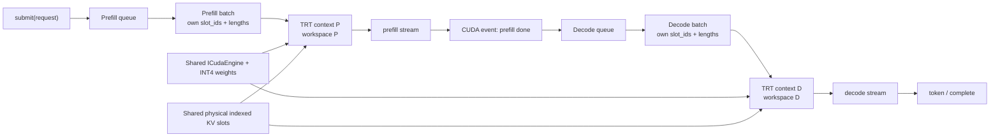

# Prefill/Decode dual-stream PoC와 queue scheduler

## 이번 단계에서 구현된 것

- CUDA context는 추가로 만들지 않는다. 한 프로세스의 동일 CUDA primary context를 사용한다.
- TensorRT `ICudaEngine`과 external INT4 weights, physical KV tensor, RoPE cache, PLE table은 공유한다.
- prefill과 decode는 각각 독립 `IExecutionContext`, USER_MANAGED workspace, auxiliary streams, `PipelineIO`,
  `TensorMap`, main CUDA stream을 가진다.
- `kv_slot_ids`와 `kvcache_start_index`는 phase-local tensor로 binding한다. PoC에서는 prefill slot과 decode slot이
  겹치지 않도록 정적으로 나눴다.
- 각 phase 시작/끝과 두 phase 전체 makespan을 CUDA event로 측정한다.
- host scheduler는 prefill/decode queue를 별도로 보유하고 서로 다른 최대 batch 크기로 pop한다.
- scheduling policy는 callback으로 교체할 수 있다. 제공 기본안은 짧은 prefill만 decode와 overlap한다.

관련 코드:

- `cpp/runtime/exec/engineExecutor.{h,cpp}`: `createSibling()`과 shared engine ownership
- `cpp/runtime/scheduling/phaseQueueScheduler.{h,cpp}`: 두 queue와 기본/custom policy
- `examples/llm/llm_phase_bench.cpp`: sequential/dual-stream CUDA-event 비교
- `cpp/runtime/preprocess/gemma4EmbeddingPreprocessor.*`: PLE table/output의 additional phase binding
- `cpp/runtime/state/externalWeightManager.*`: external weight의 additional TensorMap zero-copy binding

## 실행 구조

같은 요청은 `prefill done` event 전에는 decode queue로 이동하면 안 된다. 서로 다른 요청의 PB와 DB만 동시에
실행한다. physical slot lease는 request lifetime 동안 stable해야 하며 두 batch의 slot 집합은 disjoint여야 한다.

## RTX 3080 측정 결과

조건은 Gemma 4 E2B INT4-AWQ indexed engine, CUDA graph off, warmup 20회, sequential/concurrent 각각 100회다.
각 iteration 순서는 번갈아 실행해 thermal/order bias를 줄였다.

| Prefill B/S | Decode B/past | Sequential makespan median | Concurrent makespan median | Speedup | Decode median: seq → concurrent |
|---:|---:|---:|---:|---:|---:|
| 1 / 128 | 1 / 128 | 24.253 ms | 21.244 ms | 1.142x | 5.696 → 8.735 ms |
| 1 / 512 | 1 / 512 | 54.835 ms | 51.036 ms | 1.074x | 6.529 → 14.059 ms |
| 1 / 1024 | 1 / 1536 | 111.233 ms | 106.605 ms | 1.043x | 7.528 → 25.360 ms |
| 2 / 128 | 2 / 128 | 31.045 ms | 27.874 ms | 1.114x | 5.854 → 10.994 ms |
| 2 / 512 | 2 / 512 | 95.688 ms | 91.630 ms | 1.044x | 6.772 → 23.664 ms |
| 2 / 1024 | 2 / 1536 | 207.264 ms | 202.567 ms | 1.023x | 7.760 → 43.314 ms |

raw sample은 `notes/gemma4-e2b-phase-overlap-*.csv`에 있다. 최악 크기 BS2+2/input1024/past1536의 별도
VRAM polling에서는 peak compute memory가 8626 MiB였다. 10 GiB 카드에서 약 1614 MiB가 남았지만, 이 수치는
full `handleRequest()`의 tokenizer/embedding/sampling/response 상태가 없는 phase benchmark 값이다.

## 측정이 말해주는 것

GPU makespan은 모든 구간에서 줄었지만 decode latency는 크게 나빠졌다. prefill이 길수록 SM과 memory bandwidth를
오랫동안 점유하기 때문이다. 따라서 `항상 overlap`은 throughput 정책일 뿐 latency-safe 정책이 아니다.

현재 기본 scheduler 값은 다음과 같다.

- `maxPrefillBatchSize=1`
- `maxDecodeBatchSize=4`
- `maxOverlapPrefillTokens=128`
- `decodeBurstLimit=8`

두 queue에 일이 있을 때 candidate prefill token 합이 128 이하이면 overlap한다. 그보다 크면 decode-only를
선택하고, decode-only 결정이 8번 연속되면 starvation 방지를 위해 prefill batch를 한 번 admission한다. 이 값은
초기안이며 실제 serving SLO에 맞춰 policy callback으로 바꾸는 것이 전제다.

## 아직 runtime에 연결되지 않은 경계

`PhaseQueueScheduler`와 dual-context executor/benchmark는 구현됐지만 기존 synchronous `handleRequest()`를 대체하는
public `submit()/poll()/cancel()` API와 worker loop는 아직 연결하지 않았다. 다음 단계는 다음 순서가 안전하다.

1. global physical slot length tensor와 prefill/decode active length view의 gather/scatter 구현
2. request lifetime slot lease와 phase 전환 event ownership 구현
3. scheduler dispatch plan을 두 executor의 phase-local `PipelineIO`에 binding
4. 결과 token별 decode 재queue, finish/eviction slot release
5. decode p95 SLO feedback로 `maxOverlapPrefillTokens`를 동적으로 조절
6. Nsight Systems로 실제 concurrent kernel 구간과 SM utilization 확인

SM mask/Green Context backend는 이 queue/context 분리가 correctness를 통과한 뒤 붙인다. scheduler policy와 SM 제어
backend는 별도 interface로 유지해야 mask 미지원 GPU에서도 같은 queue logic을 검증할 수 있다.
