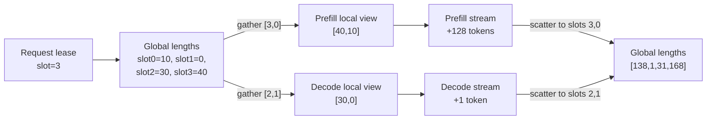

# Chunked prefill과 physical-slot KV length view

## 이번 단계의 구현 범위

Indexed-linear KV cache의 data tensor뿐 아니라 sequence length도 physical slot 기준으로 안정화했다.

- global length store: GPU `INT32[maxSlots]`, physical slot lifetime 동안 유지
- phase-local view: GPU `INT32[phaseBatch]`, prefill/decode context가 각각 소유
- phase 시작: `globalLengths[kv_slot_ids[row]]`를 local view로 gather
- phase 완료: local increment를 해당 physical slot에 반영하고 local view도 갱신
- indexed eviction: length compaction을 하지 않고 새 row 순서로 gather
- slot release: global length를 0으로 만들어 다음 lease에서 stale offset이 남지 않게 함

`PhaseQueueScheduler`에는 `kvSlotId`, `tokenOffset`, `promptTokenCount`, `maxPrefillChunkTokens`를 추가했다. 긴 prompt는
한 번에 queue에서 제거되지 않고 chunk 하나만 in-flight가 된다. 완료된 chunk가 마지막이 아니면 offset을 전진시켜
prefill queue에 다시 넣고, 마지막 chunk일 때만 decode queue로 이동한다.

## 데이터 연결



서로 다른 stream이 global tensor 하나를 갱신하지만 동시에 dispatch되는 phase의 slot 집합은 반드시 disjoint해야
한다. 현재 scheduler/allocator contract가 이를 보장하는 전제이며, 같은 slot을 두 stream에서 갱신하는 것은 지원하지
않는다.

## Eviction과 파편화

예를 들어 active row의 physical mapping이 `[0,1,2,3]`이고 logical mapping `[1,-1,2,0]`으로 row 1을 제거하면 새
active mapping은 `[3,0,2]`다.

```text
physical KV slots:  [ slot0 ][ slot1 ][ slot2 ][ slot3 ]
ownership before:  [ req-A ][ req-B ][ req-C ][ req-D ]
ownership after:   [ req-A ][ free  ][ req-C ][ req-D ]
logical rows:      [ req-D(slot3), req-A(slot0), req-C(slot2) ]
```

KV data는 이동하지 않는다. local length만 `[slot3, slot0, slot2]` 순서로 gather된다. 따라서 중간 hole은 생기지만
external fragmentation은 아니다. 모든 slot 크기가 동일하고 free-list가 hole을 그대로 재사용하기 때문이다.

남는 비효율은 internal fragmentation이다. 각 slot은 `maxKVCacheCapacity` 전체를 미리 확보하므로 짧은 sequence도
긴 sequence와 같은 물리 용량을 차지한다. 이번 indexed-linear v1은 compaction 제거와 stable ownership이 목적이므로
이 비용을 유지한다. 이후 동시 request 수나 context 길이 분산이 커지면 paged allocator와 비교해야 한다.

추가 metadata 비용은 작다.

- global lengths: `4 * maxSlots` bytes
- phase-local lengths: phase마다 `4 * phaseBatch` bytes
- slot IDs와 release scratch: 각각 `4 * maxSlots` bytes

## 실제 chunked-prefill engine 경로

`llm_phase_bench --prefillChunkSize N`은 하나의 prompt를 여러 prefill enqueue로 실행한다.

1. 첫 chunk: `kvcache_start_index` shape `[0]`인 empty-cache sentinel
2. 후속 chunk: shape `[B]`, 값은 이전 chunk까지 누적된 KV length
3. 각 chunk 후 local length 증가
4. chunk 수만큼 decode step도 실행해 sequential/concurrent의 작업량을 동일하게 유지

Gemma 4 E2B INT4-AWQ indexed engine, RTX 3080, BS1, prompt 512, past KV 512의 짧은 smoke 결과는 다음과 같다.
측정은 warmup 1회, sample 3회라 gate 수치가 아니라 동작/대략적 비용 확인용이다.

| 실행 | 작업량 | Sequential median | Concurrent median | Speedup |
|---|---:|---:|---:|---:|
| unchunked | prefill 512 1회 + decode 1회 | 54.34 ms | 50.62 ms | 1.0735x |
| chunked | prefill 128 4회 + decode 4회 | 107.35 ms | 92.80 ms | 1.1568x |

chunking은 총 prefill 처리량을 높이는 최적화가 아니다. 네 번의 engine enqueue와 짧은 attention kernel 때문에
prefill 총 비용이 증가한다. 얻는 것은 최대 약 82ms짜리 prefill 구간을 약 20ms 단위 scheduling point 네 개로
나눌 수 있다는 점이다. 실제 serving policy는 decode p95 개선과 prefill overhead 사이에서 chunk 크기를 선택해야 한다.

## 검증 상태와 남은 경계

통과한 검증:

- `[3,0,2]` logical mapping에서 global/local length 일치
- released slot length 0 초기화
- scalar/per-row increment의 physical slot 반영
- 서로 다른 non-blocking CUDA stream에서 disjoint prefill/decode view 갱신
- HybridCacheManager/scheduler/allocator 테스트 25개
- 실제 Gemma indexed engine의 128-token 4-chunk prefill과 4-step decode dual-stream 실행

아직 production `handleRequest()`는 chunk scheduler worker loop를 사용하지 않는다. benchmark는 engine/plugin의 실제
chunk contract를 실행하지만 tokenizer, sampling, response lifecycle을 포함한 public async serving API는 다음 단계다.
다음 연결 순서는 `DispatchPlan -> phase-local PipelineIO binding -> CUDA event completion -> completePrefill/completeDecode`
worker loop이며, 그 뒤 output token 동일성 및 decode p95를 다시 측정해야 한다.
