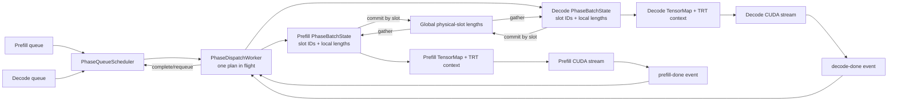
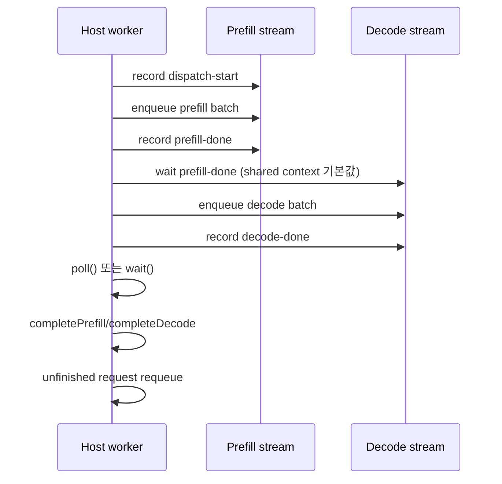

# Phase batch binding과 CUDA event dispatch worker

## 이번 단계의 구현 범위

`PhaseQueueScheduler`의 plan을 TensorRT 실행 경로에 전달하는 중간 계층을 추가했다.

- `PhaseBatchState`: phase별 고정 주소의 slot ID/length tensor 소유
- `PhaseDispatchWorker`: scheduler plan dispatch, CUDA event 완료 확인, request requeue
- `llm_phase_bench`: 수동 stream enqueue 대신 scheduler와 worker를 거쳐 실제 Gemma engine 실행

기존 public `LLMInferenceRuntime::handleRequest()`는 바꾸지 않았다. 현재 worker callback 경계는 TensorRT engine
enqueue까지이며 tokenizer, embedding 입력 생성, sampling, response 반환을 포함하는 async serving API는 아직 아니다.

## 데이터와 실행 연결

`PhaseBatchState::bind()`는 `kv_slot_ids`와 `kvcache_start_index`에 member tensor를 한 번 연결한다. tensor 객체와
allocation 주소는 phase context lifetime 동안 유지된다. dispatch 때 `prepare()`가 active prefix만 reshape하고 slot
ID를 올린 뒤 `globalLengths[slot]`을 phase-local view로 gather한다. kernel 완료 후 `commit()`은 같은 physical slot에
길이를 반영한다.

동시에 실행하는 prefill/decode batch의 physical slot 집합은 서로 달라야 한다. `PhaseBatchState`는 batch 내부의
duplicate와 out-of-range slot을 거부하지만 두 state 사이의 교집합 검사는 scheduler/lease owner의 책임이다.

## Event 순서

v1은 plan 하나만 in-flight로 둔다. `kSharedSerialized` 기본 모드는 stream은 분리하지만 같은 TensorRT
execution context의 동시 enqueue를 막기 위해 decode stream이 `prefill-done`을 기다린다.
`kIndependentConcurrent`는 prefill/decode가 독립 execution context와 workspace를 가진 benchmark 경로에서만
명시적으로 선택한다. 다음 plan은 두 완료 event를 확인한 후 dispatch한다.

## RTX 3080 Gemma 4 E2B 결과

조건은 INT4-AWQ indexed engine, BS1 prefill/decode, prompt 512를 128-token chunk 4회, past KV 512에서 decode
4회, warmup 1회와 sample 3회의 smoke다.

| 경로 | Sequential median | Concurrent median | makespan speedup | Concurrent decode median |
|---|---:|---:|---:|---:|
| PhaseBatchState만 연결 | 99.5400 ms | 87.7814 ms | 1.1340x | 36.1615 ms |
| Scheduler + DispatchWorker | 99.3167 ms | 87.0287 ms | 1.1412x | 35.3372 ms |

이는 성능 gate가 아니라 연결 smoke다. raw sample은 `gemma4-e2b-phase-state-smoke.csv`와
`gemma4-e2b-phase-worker-smoke.csv`에 보존했다. 이전 결과처럼 makespan은 줄지만 concurrent decode latency는
sequential 25.22ms에서 35.34ms로 증가한다. 실제 serving 기본 policy가 긴 prefill을 무조건 overlap하면 안 되는
근거가 다시 확인됐다.

같은 worker 경로를 GPU idle 상태에서 warmup 20회, mode별 100회 측정한 결과는 다음과 같다.

| Sequential median / p95 | Concurrent median / p95 | makespan speedup | Decode median 변화 |
|---:|---:|---:|---:|
| 99.4171 / 100.0192 ms | 87.0236 / 87.7240 ms | 1.1424x | 25.3020 → 35.4058 ms (+39.9%) |

raw sample은 `gemma4-e2b-phase-worker-bs1_i512_c128_p512.csv`에 보존했다. 이 수치는 두 phase를 항상 overlap하는
강제 policy의 결과다. 기본 queue policy의 128-token admission 조건과 실제 queue load별 decode p95는 public
request lifecycle을 연결한 뒤 별도로 측정해야 한다.

검증 결과:

- scheduler/state/worker 관련 14개 회귀 테스트 통과
- compute-sanitizer memcheck: 0 errors
- legacy/indexed `llm_basic`의 output text와 finish reason 일치
- actual Gemma TensorRT prefill/decode enqueue가 worker callback과 CUDA event 경로를 통과

## 다음 구현 경계

production prefill/decode의 enqueue와 host completion 경계는 다음 단계에서 분리했다. 자세한 내용은
[Production prefill/decode async completion 경계](11-async-phase-completion.md)를 참고한다.

1. `enqueuePrefillCompute()`와 `enqueueDecodeCompute()`는 GPU 작업과 done event만 반환
2. sampling/finished 판단은 event 완료 후 별도 completion 단계에서 수행
3. request별 `PipelineIO` active row와 output buffer를 phase batch에 맞게 reshape/gather
4. `submit/poll/cancel` lifecycle과 slot lease release 연결
5. decode p95를 포함한 queue load benchmark와 policy feedback 추가

SM mask 또는 CUDA Green Context backend는 이 lifecycle correctness가 끝난 뒤 stream 생성/dispatch 계층 뒤에 붙인다.
queue policy는 backend와 독립적으로 유지한다.
