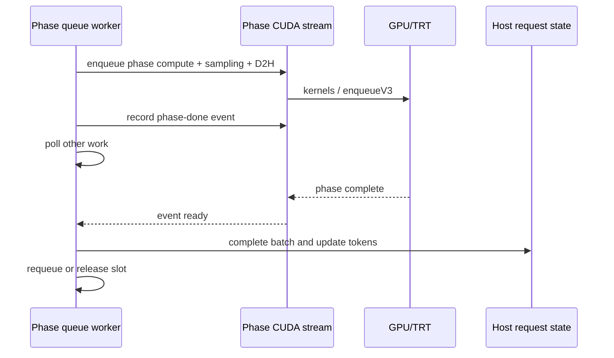

# Production prefill/decode async completion 경계

## 이번 단계에서 바뀐 것

기존 production 경로는 GPU enqueue, sampling 결과 D2H, `cudaStreamSynchronize()`, host token 반영을
한 함수 안에서 수행했다. 이 구조에서는 worker가 event를 기다리는 동안 host thread가 다른 queue를 처리할 수 없다.

- `VanillaDecoder::enqueueDecodeStep()`: embedding, TensorRT decode, KV commit, sampling, 결과 D2H를 enqueue
- `VanillaDecoder::completeDecodeStep()`: event 완료 후 token/logprob/debug 상태를 host context에 반영
- `LLMInferenceRuntime::enqueueBaseModelPrefill()`: prefill, KV commit, sampling, 결과 D2H를 enqueue
- `LLMInferenceRuntime::completeBaseModelPrefill()`: event 완료 후 첫 token과 callback을 반영
- 기존 synchronous wrapper는 enqueue 뒤 stream을 동기화하는 completion을 호출해 `handleRequest()` 동작을 유지



## 같은 TensorRT context에서 두 stream을 쓰는 의미

CUDA stream이 두 개여도 같은 TensorRT `IExecutionContext`에 prefill과 decode를 동시에 `enqueueV3()`하는 것은
지원되는 실행 모델이 아니다. 기본 `kSharedSerialized`는 queue, batch, stream, event를 분리하되 enqueue를 정렬한다.

```text
prefill stream: [prefill enqueue] -------- [prefill-done]
decode stream :                         wait ^ [decode enqueue] --- [decode-done]
```

이 모드의 이점은 계산 overlap이 아니라 다음과 같다.

- prefill/decode queue를 독립적으로 batch하고 정책으로 순서를 선택
- CPU thread의 불필요한 stream synchronize 제거
- stable KV slot 소유권을 유지하면서 host completion을 event 이후로 이동
- phase별 event latency와 queue wait를 분리 계측

실제 kernel overlap은 별도 `IExecutionContext`, USER_MANAGED workspace, phase별 I/O buffer를 가질 때만
`kIndependentConcurrent`로 opt-in한다. 기존 dual-context benchmark 수치는 이 모드의 결과다.

## In-flight 안전 조건

- 한 decoder/runtime 인스턴스에는 같은 phase의 step 하나만 in-flight로 둔다.
- enqueue 때 context pointer와 active batch size를 저장하고 completion에서 일치 여부를 검사한다.
- host selected-token/logprob buffer는 event 완료 전에 reshape하거나 재사용하지 않는다.
- completion은 batch 단위로 한 번만 호출한 뒤 request별 scheduler 상태를 갱신한다.

## 검증에서 발견한 빌드 주의점

`LLMInferenceRuntime`와 `DecodingStrategy` 헤더가 바뀌면 이를 생성하거나 호출하는 모든 translation unit을 함께
재빌드해야 한다. stale object가 남아 class layout/vtable ABI가 섞였을 때 Gemma 출력이 첫 토큰 `Here`만 반복됐다.
clean rebuild 후 변경 전 출력이 복구됐고, 일관된 rebuild로 async split을 적용한 뒤에도
`Here is an introduction to NVIDIA...` 출력이 유지됐다.

따라서 비정상 토큰 반복이 보이면 `edgellmCore`, plugin, `llm_inference`, `unitTest`의 헤더 의존 대상이 모두
재빌드됐는지 먼저 확인한다.
