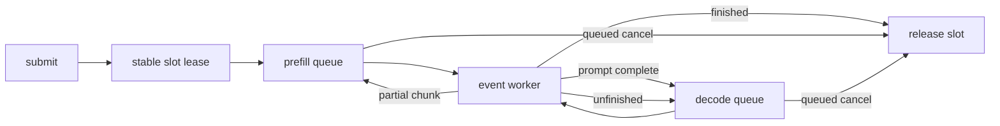

# Continuous request lifecycle과 stable slot lease

## 이번 단계에서 구현한 것

`PhaseRequestLifecycle`을 추가해 request ID, scheduler 상태, physical KV slot lease를 한 객체가 소유하게 했다.

- `submit(requestId, promptTokens)`: lowest free slot을 reserve하고 prefill queue에 등록
- chunk completion: KV length와 prompt offset을 갱신하고 마지막 chunk에서 decode queue로 전환
- decode completion: unfinished request는 재등록하고 finished request는 slot 반환
- `cancel(requestId)`: queued request만 제거하고 slot 반환
- request snapshot: phase, prompt length, KV length, 현재 slot을 조회

## 상태와 소유권 흐름

request record는 terminal 상태도 보존하지만 `kvSlotId=-1`로 바뀐다. 따라서 완료 응답을 조회할 수 있으면서 physical
slot은 즉시 새 request에 재사용할 수 있다. allocator는 가장 낮은 번호의 free slot을 선택해 재사용이 deterministic하다.

## Cancel 규칙

CUDA event가 끝나지 않은 in-flight request는 cancel할 수 없다. `cancel()`은 `false`를 반환하고 slot을 유지한다.
event completion이 host state와 KV length를 반영해 request가 다시 queue에 들어간 뒤에는 cancel할 수 있다. 이 순서로
use-after-release와 완료 callback이 이미 재사용된 slot을 갱신하는 문제를 막는다.

## 현재 production 연결 경계

lifecycle은 execution callback을 통해 TensorRT 작업을 호출하므로 queue/lease 정책과 model runtime을 분리한다.
현재 callback 계약에는 다음이 연결될 수 있다.

- `enqueueBaseModelPrefill()` / `completeBaseModelPrefill()`
- `VanillaDecoder::enqueueDecodeStep()` / `completeDecodeStep()`
- phase-local `PhaseBatchState`의 slot ID와 KV length gather/commit

다만 production의 여러 개 `DecodingInferenceContext`를 phase batch 하나로 pack하는 adapter는 아직 구현하지 않았다.
현재 단계는 continuous admission의 host ownership을 완성한 것이며 실제 Gemma request batching은 다음 단계다.
같은 TensorRT execution context를 쓰는 기본 모드에서는 prefill/decode enqueue가 event로 직렬화된다.

## 검증 항목

- capacity exhaustion과 lowest-slot deterministic reuse
- chunked prefill에서 동일 slot 유지 후 decode 전환
- 서로 다른 output length를 흉내 낸 decode requeue와 finish slot 반환
- queued cancel slot 반환
- in-flight cancel 거부와 event 완료 후 cancel 허용
