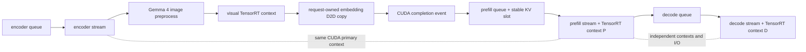

# Gemma 4 E2B VLM three-phase, adaptive prefill, kernel-group 결과

## 완료한 실행 구조

Gemma 4 E2B는 text-only 모델이 아니라 Gemma 4 vision encoder와 Gemma 3 계열 LLM을 묶은 VLM이다. 이번
실험에서는 LLM backbone만 INT4-AWQ이고 PLE, embedding, LM head, KV cache, vision encoder는 FP16이다.



- `PhaseThreeCoordinator`는 encoder worker와 prefill/decode worker를 non-blocking event poll로 함께 진행한다.
- 세 stream은 `CUcontext`가 같아야 한다. prefill/decode의 mutable TensorRT execution context, workspace,
  I/O는 서로 달라야 overlap을 허용한다.
- `Gemma4PhaseVisionAdapter`는 실제 `MultimodalRunner`의 `preprocess()`와 `infer()`를 encoder queue에 연결한다.
  runner의 재사용 output이 다음 요청에서 덮이지 않도록 encoder stream에서 request-owned GPU tensor로 D2D copy한
  후에만 completion event가 기록된다.
- Gemma 4 visual bidirectional attention은 현재 prefix/chunk reuse를 지원하지 않으므로 VLM prefill work item은
  `allowChunkedPrefill=false`로 보낸다. Adaptive chunking은 text-only prompt에 적용한다.

## 재현 가능한 VLM 환경

[`run_vlm_pipeline.sh`](../scripts/gemma4_e2b_indexed/run_vlm_pipeline.sh)는 stage별로 실행할 수 있다.

```bash
WORK_DIR=/tmp/gemma4-e2b scripts/gemma4_e2b_indexed/run_vlm_pipeline.sh export
WORK_DIR=/tmp/gemma4-e2b scripts/gemma4_e2b_indexed/run_vlm_pipeline.sh build
WORK_DIR=/tmp/gemma4-e2b scripts/gemma4_e2b_indexed/run_vlm_pipeline.sh infer
```

- export: PyTorch 25.12 container, 원본 HF checkpoint의 FP16 visual ONNX만 export
- build/runtime: TensorRT 26.06, CUDA 13.3, visual profile `min=4`, `max total=1120`, `max/image=280`
- inference: indexed INT4 LLM + FP16 vision engine + deterministic `gemma4_multi_image_basic.json`, generation 64 tokens

`maxImageTokens=280`으로 만든 최초 engine은 두 장짜리 request를 거부했다. 총 image-token profile과 이미지당
profile은 별도이므로 총 profile을 1120으로 늘렸다.

## RTX 3080 10GB 실제 VLM 결과

2026-08-02 실행은 두 request 모두 runtime 성공했다.

| 항목 | 결과 |
|---|---:|
| vision 입력 | 3 images / 782 image tokens |
| vision TensorRT | 2 runs, total 48.86 ms, mean 24.43 ms |
| LLM prefill | 818 computed tokens, total 99.65 ms |
| generation | 29 tokens, 162.9 token/s |
| peak GPU memory | 8,894 MiB |
| 9,874 MiB 기준 headroom | 약 980 MiB |

최초 `vlm_basic.json` 실행은 해변의 여성과 개를 올바르게 기술했지만 두 이미지 비교 request에서 이미지를 다시
요구했다. 이 workload는 `temperature=1`, `top_k=50`이므로 그 한 번의 출력만으로 placement 오류를 판정할 수
없었다. 이후 greedy(`temperature=0`, `top_k=1`) 진단에서 다음을 확인했다.

- red panda와 giant panda를 각각 단일 이미지로 정확히 식별했다.
- `red panda -> giant panda` 두 이미지와 역순 `giant panda -> red panda` 모두 입력 순서를 정확히 유지했다.
- indexed engine과 legacy engine의 5개 진단 request 출력은 byte-for-byte 동일했다.
- tokenizer가 만든 image placeholder 수와 visual embedding row 수가 정확히 일치했다.

따라서 관측된 "이미지를 제공해 달라"는 응답은 indexed KV 또는 multi-image embedding placement 오류가 아니라
확률적 decoding과 모호한 비교 prompt에서 나온 false negative였다. 재현 스크립트는 이제 단일 이미지 두 건과
정방향/역방향 두 이미지 두 건을 포함한 deterministic 회귀 workload를 사용한다. Runtime도 explicit image token을
다른 out-of-vocabulary special token과 혼동하지 않으며, placeholder 수와 embedding row 수가 다르면 즉시 실패한다.

최종 indexed 회귀 실행은 4/4 request, 6 images, 1,566 image tokens를 처리했다. Vision encoder GPU time은
100.21ms, LLM prefill은 1,692 computed tokens와 189.49ms, generation은 168.2 token/s였고 peak GPU memory는
8,894MiB였다. 동일 workload의 legacy와 indexed 생성 문자열은 모두 byte-for-byte 일치했다.

## Adaptive chunked prefill 실측과 수정

동일 workload는 `BS(P/D)=2/2`, prompt 512, output 8, 12 requests, 100 requests/s, 최대 chunk 128이다.

| 정책 | 처리량 req/s | TTFT median/p95 ms | E2E median/p95 ms | dispatch |
|---|---:|---:|---:|---:|
| fixed 128 | 13.024 | 394.096 / 739.650 | 560.919 / 812.929 | 51 |
| 최초 adaptive | 11.941 | 474.484 / 809.230 | 612.645 / 904.972 | 61 |
| 수정 adaptive | 13.005 | 394.708 / 741.258 | 562.011 / 814.072 | 51 |

최초 정책은 decode queue wait가 2ms를 넘으면 GPU 비용과 무관하게 64-token chunk를 만들었다. 그 결과 같은
prompt를 처리하기 위한 TensorRT prefill 실행이 25회에서 29회로 늘었다. 수정 정책은 chunk size를
`EWMA prefill GPU ms/token`, overlap 효율, configurable GPU-time budget으로만 정한다. Queue wait/deadline은
phase 선택 정책이 담당한다. 수정본의 fixed 대비 처리량 차이는 -0.15%, TTFT median 차이는 +0.16%다.

## Kernel-group CUDA event segmentation

계측은 실제 enqueue 경로를 다음 group으로 분리한다.

- encoder: `encoder_preprocess`, `encoder_engine` (request-owned embedding copy 포함)
- prefill: `prefill_prepare`, `prefill_engine`, `prefill_cache_commit`, `prefill_sample`
- decode: `decode_prepare`, `decode_engine`, `decode_sample`

같은 dispatch 안의 인접 group은 stream이 달라도 `cudaStreamWaitEvent`로 순서를 보장한다. 서로 다른 dispatch는
독립적이므로 E/P/D overlap을 막지 않는다. benchmark의 `--kernelGroupCsv FILE`이 group별 GPU 시간을 기록한다.
fixed workload에서 median은 prefill engine 30.537ms, decode engine 7.107ms였고 prepare/cache/sample은 각각
대부분 0.03ms 미만이었다.

여기서 `prefill_engine`과 `decode_engine`은 각각 한 번의 TensorRT `enqueueV3()`다. Host CUDA event는 그
내부 transformer layer/kernel 사이에 삽입할 수 없다. 따라서 phase-level kernel-group segmentation은
완료됐지만, TensorRT engine 내부 layer-group 분할은 별도 multi-engine export/build 작업이다.

## 검증

- 관련 GPU unit tests: 19/19 통과 후 adaptive regression 추가, scheduler 14/14 통과
- actual indexed LLM continuous-load: fixed와 수정 adaptive 모두 12/12 terminal 완료
- actual indexed LLM + actual vision engine: deterministic single/multi-image 순서 진단 완료
- phase microbenchmark: independent TensorRT contexts, shared CUDA context에서 median makespan 1.1096x 개선
